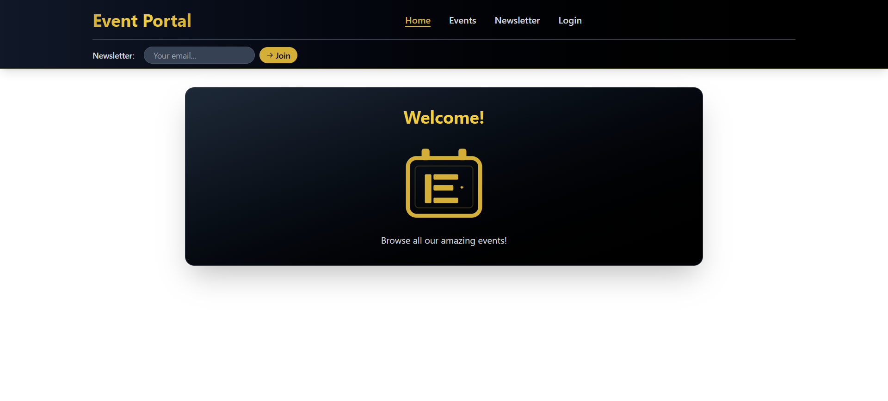
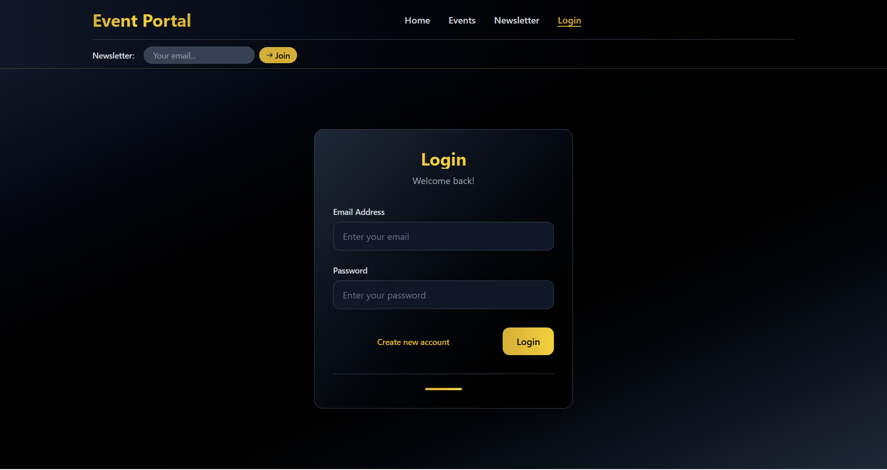
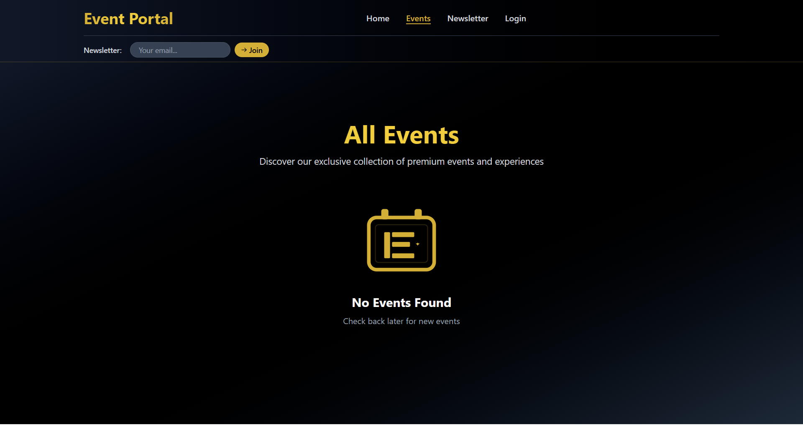
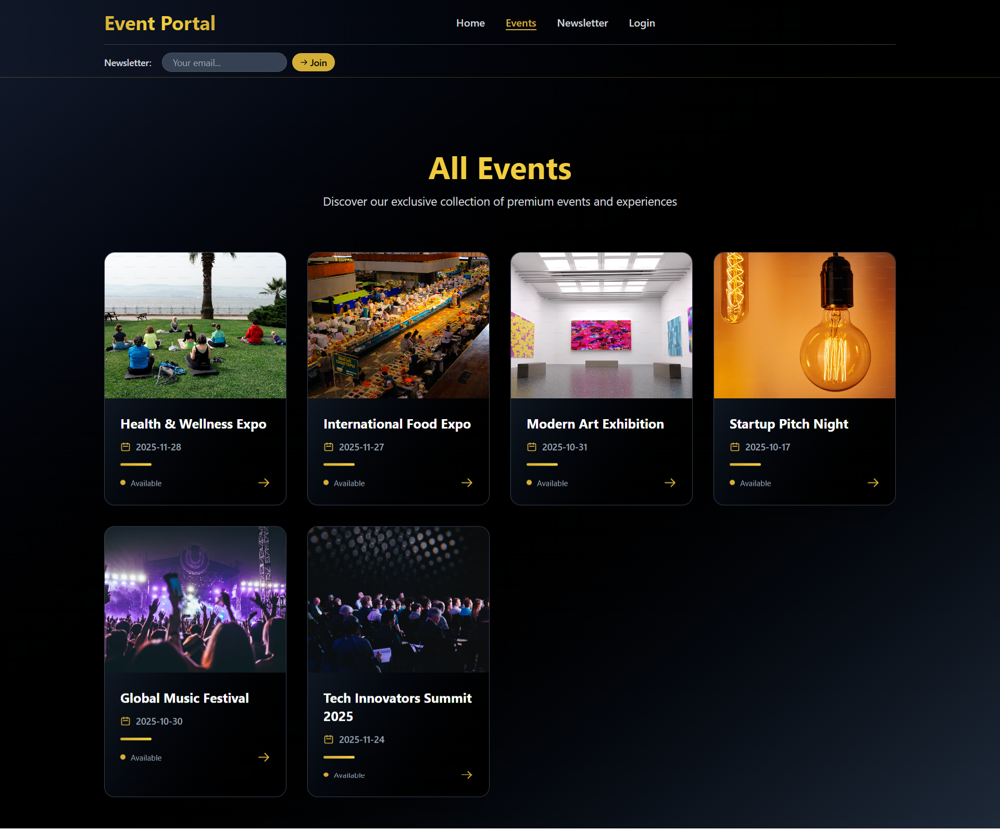
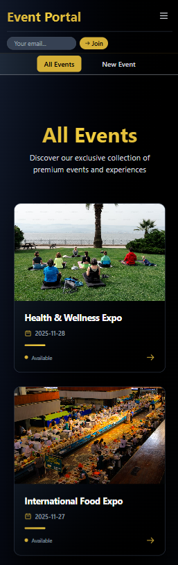
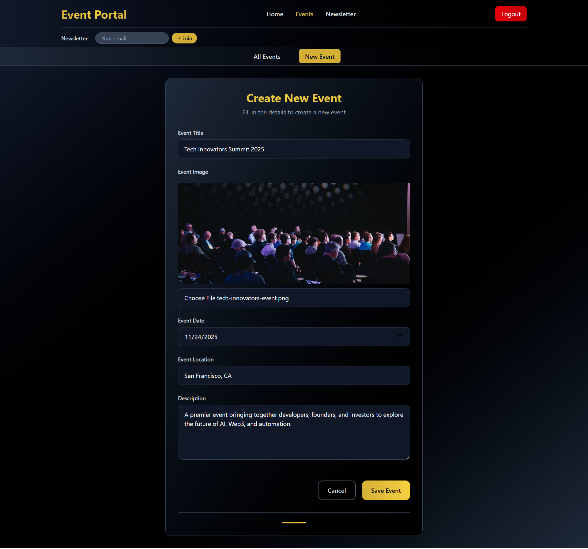
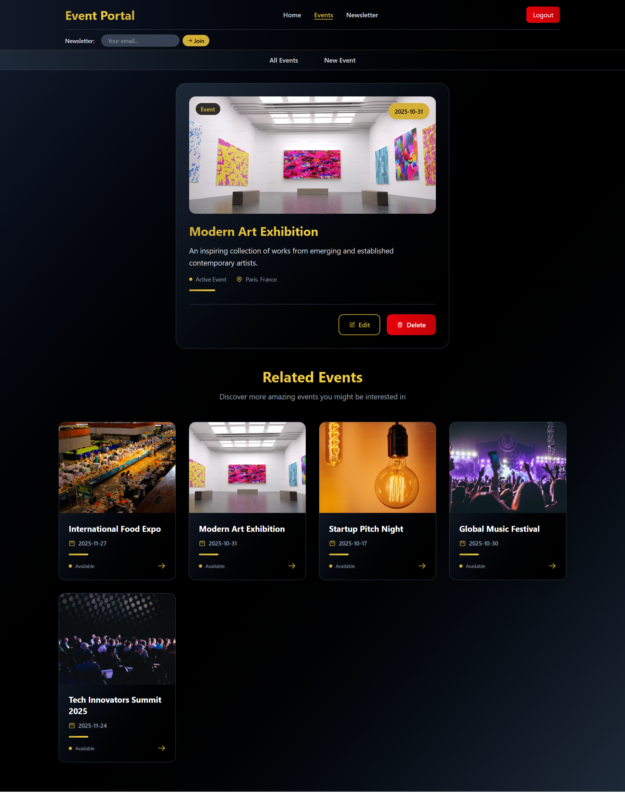
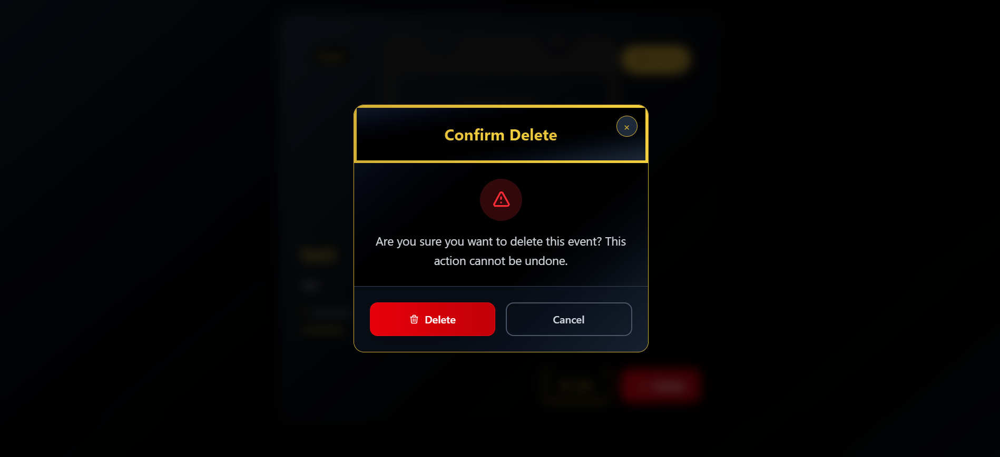
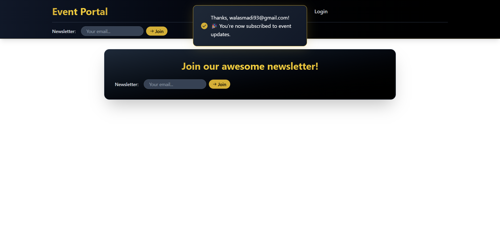

# 📆 Event Portal


A modern **full-stack** events portal built with **React + React Router (data APIs)** that allows users to **browse, create, edit, and manage events**, subscribe to newsletters, and handle **authentication** via tokens — all wrapped in a **responsive and elegant interface**.

## 🚀 Features

### Frontend

- 📅 **Browse Events** – Display events list from a backend API.
- 🔍 **Event Details** – Load detailed data with defer concept, `Await`, and `Suspense` for optimized rendering.
- ✏️ **Create / Edit / Delete Events** – Full CRUD using **React Router action & loader** logic.
- 🔐 **Authentication System** – Login & signup with token storage in localStorage, automatic logout on token expiration.
- 💌 Newsletter Subscription – Built with **useFetcher** + **react-hot-toast** for instant UX feedback.
- ⚡ **Dynamic Routing & Data Fetching** – Fully powered by React Router v6.22+ Data APIs.
- 🧭 **Protected Routes** – Conditional access based on token presence.
- 🎨 Reusable UI Components – Modal (with portals), ConfirmModal, Forms, Buttons, and Event Cards.
- 🌙 Responsive & Modern UI – TailwindCSS styling and consistent design system.
- 🔔 **Toast Notifications** – Custom-configured react-hot-toast for success/error feedback.

### 🏗️ Backend

- ⚙️ Implemented with **Node.js + Express** (used as a ready backend source)
- 🔌 Uses a prebuilt REST API for fetching and managing events
- 📂 JSON file storage (easy to replace with DB)
- 🌐 Endpoints for retrieving, creating, updating, and deleting events
- 🔁 Ready to extend with DB, or cloud deployment

---

## 🛠️ Tech Stack

### 🖥️ Frontend

- **React 19.2.0** (hooks: `useState`, `useRef`, `useEffect`)
- **React Portals** for modal rendering
- **FormData object** for handling the form's event
- **localStorage** for Login / Logout
- Implemented routing using React Router (v6+) with:
  - `createBrowserRouter` + `RouterProvider` with **Route Objects**.
  - **Nested routes** & **Layouts** with `<Outlet />`
  - **Index route** (only one per parent)
  - **Navigation**: `<Link>`, `<NavLink>`, `useNavigate`, `redirect`
  - **Dynamic routes** (`:id`) + `useParams`
  - **Query params** with `useSearchParams`
  - **Data APIs**: `loader` (pre‑render data), `action` (mutations), `useLoaderData`, and `useActionData`
  - **useNavigation** for pending UI
  - **<Form>** integrates with actions/URL updates (GET/POST).
  - **useSubmit** and **useFetcher** (navigation vs no navigation)
  - **Error handling**: `errorElement`, `throw Response`
  - **Delay rendering**: `<Suspense>`, Await, and defer
- **React Hot Toast** for UI feedback
- **JavaScript(ES6+)**
- **TailwindCSS/Styling**
- **Vite** (for development and build)

### 🏗️ Architecture & Patterns

- Clean Separation: Components, pages, loaders, actions, and utilities are well-structured.
- Custom Utilities:
  - For authentication and auto-logout logic like: `getTokenDuration()`, `getAuthToken()` and others.
  - For resolveing image URLs dynamically by `getImageUrl()`

#### ⚡ Deferred Data Loading with defer, Await, and Suspense

Implements **progressive data fetching** using React Router’s **defer**, and `<Suspense fallback>` + `<Await resolve={promise}>` — providing faster perceived performance and smoother UX.

- The eventDetailLoader returns a deferred object combining a single event (awaited immediately) and a list of events (loaded in the background):

  ```javascript
  export async function eventDetailLoader({ params }) {
    const id = params.eventId;
    return {
      event: await loadEvent(id), // fetched immediately
      events: loadEvents(), // deferred
    };
  }
  ```

- Inside the EventDetailPage, the `<Suspense>` and `<Await>` components handle loading states separately for each data source:

  ```javascript
  <Suspense fallback={Loading event details...}>
    <Await resolve={event}>
      {(loadedEvent) => <EventItem event={loadedEvent} />}
    </Await>
  </Suspense>

  <Suspense fallback={Loading related events...}>
    <Await resolve={events}>
      {(loadedEvents) => <EventsList events={loadedEvents} />}
    </Await>
  </Suspense>
  ```

### 🛠️ Backend (Full-stack version)

- Node.js
- Express.js for creating REST API endpoints
- JSON files for data storage (events.json)

---

## 📂 Project Structure

### Frontend Structure

```text
event-portal/frontend/
├─ public/
│  ├─ images/
│  │  └─ placeholder-event.png/
│  └─ favicon.svg
├─ src/
│  ├─ assets/
│  │  └─ screenshots/
│  │
│  ├─ components/
│  │  ├─ auth/
│  │  │  ├─ AuthForm.jsx
│  │  │  └─ LogoutForm.jsx
│  │  │
│  │  ├─ events/
│  │  │  ├─ EventForm.jsx
│  │  │  ├─ EventItem.jsx
│  │  │  ├─ EventsList.jsx
│  │  │  └─ EventsNavigation.jsx
│  │  │
│  │  ├─ UI/
│  │  │  ├─ ConfirmModal.jsx
│  │  │  └─ Modal.jsx
│  │  │
│  │  ├─ MainNavigation.jsx
│  │  ├─ NewsletterSignup.jsx
│  │  └─ PageContent.jsx
│  │
│  ├─ lib/
│  │  ├─ actions/
│  │  │  ├─ authActions.js
│  │  │  ├─ eventActions.js
│  │  │  └─ newsletterActions.js
│  │  │
│  │  └─ loaders/
│  │     └─ eventLoaders.js
│  │
│  ├─ pages/
│  │  ├─ auth/
│  │  │  └─ Authentication.jsx
│  │  │
│  │  ├─ events/
│  │  │  ├─ EditEvent.jsx
│  │  │  ├─ EventDetail.jsx
│  │  │  ├─ Events.jsx
│  │  │  ├─ EventsRoot.jsx
│  │  │  └─ NewEvent.jsx
│  │  │
│  │  ├─ Error.jsx
│  │  ├─ Home.jsx
│  │  ├─ Newsletter.jsx
│  │  └─ Root.jsx
│  │
│  ├─ util/
│  │  ├─ auth.js
│  │  ├─ http.js
│  │  └─ image.js
│  │
│  ├─ App.jsx
│  ├─ router.jsx
│  ├─ main.jsx
│  ├─ index.css
│  └─ structure.txt
│
└─
```

#### ✨ Highlights

- components/ → Reusable UI and feature-based components (auth, events, modals, etc.)
- pages/ → Route-based pages structured by domain (auth, events, root-level)
- lib/ → Centralized actions and loaders for data fetching and mutations (React Router actions/loaders)
- util/ → Shared helper functions (HTTP logic, image utilities, auth helpers)
- assets/ → screenshots
- router.jsx → Centralized route definitions with createBrowserRouter

---

## ⚙️ Installation & Usage

### Running Frontend

Clone the repository, install frontend dependencies, and start the frontend server

```bash
git clone git@github.com:smadi2512/event-portal.git
cd event-portal
cd frontend
npm install
npm run dev
```

**Note**: The frontend will run on http://localhost:5173

### Running Backend

In a new terminal, navigate to the backend directory, install its dependencies, and start the backend server:

```bash
cd backend
npm install
npm start
```

**Note**: The backend will run on http://localhost:3000

---

## 🔐 Authentication Flow

- Token stored in localStorage with an expiration timestamp.
- `getTokenDuration()` computes remaining time → auto-logout when expired.
- Protected routes (event creation/editing) check `getAuthToken()` before access.

---

## 📸 Screenshots

<table align="center">
  <tr>
    <td>
      <h4 align="center">Event Portal Home page</h4>
      
    </td>
    <td>
      <h4 align="center">Event Portal Login page</h4>
      
    </td>
    <td>
      <h4 align="center">Event Portal with no events</h4>
      
    </td>
  </tr>
  <tr>
    <td>
      <h4 align="center">Event Portal with events list page</h4>
      
    </td>
    <td>
      <h4 align="center">Event Portal with events list on Mobile</h4>
      
    </td>
    <td>
      <h4 align="center">Event Portal with create new event</h4>
      
    </td>
  </tr>
  <tr>
     <td>
      <h4 align="center">Event Portal with event's details</h4>
      
    </td>
    <td>
      <h4 align="center">Event Portal with confirmation delete dialog</h4>
      
    </td>
    <td>
      <h4 align="center">Event Portal with custom react-hot-toast notification</h4>
      
    </td>
  </tr>
</table>

---

## 🧩 Future Improvements

- 🔐 Replace access tokens in localStorage (less secure) → to refresh tokens in HttpOnly Refresh Cookies + In-Memory Access Token
- Categorize events
- 🧭 Role-based access control (admin vs. user).
- 🗂️ Event categorization + sorting by date/location
- 🌍 Multi-language (i18n) support.
- 🧪 Add Jest + React Testing Library for testing.
- ✨ Improve animations (Framer Motion).

---

## 👩‍💻 Author

Created by **Walaa Smadi**✨ \
Passionate React developer building modern, maintainable, scalable, performant, and user-friendly web apps.

- 📧 Email: [walasmadi93@gmail.com](mailto:walasmadi93@gmail.com)
- 💼 LinkedIn: [Walaa Smadi](https://www.linkedin.com/in/walaa-bilal-smadi/)
- 🐙 GitHub: [@smadi2512](https://github.com/smadi2512)

Feel free to fork, star ⭐, and contribute!
